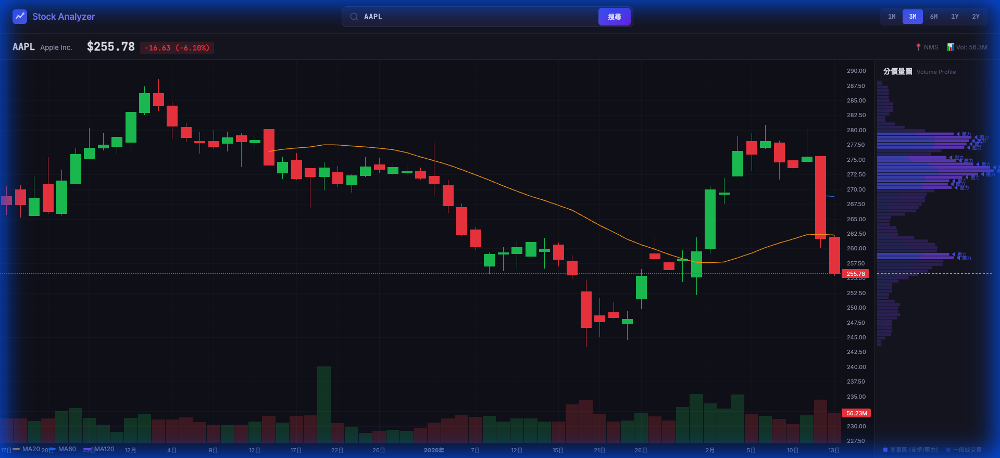

# 📈 Stock Analyzer — 美股分析工具

[繁體中文](#繁體中文) | [English](#english)

---

## 繁體中文

一個輕量的美股分析網頁工具，提供 **K 線圖、均線、成交量**與**分價量圖 (Volume Profile)**，幫助分析支撐位與壓力位。



### ✨ 功能特色

- 🕯️ **日 K 線圖** — 即時顯示股價走勢（漲綠跌紅）
- 📊 **均線 (MA)** — MA20 / MA60 / MA120，可個別開關
- 📉 **成交量** — 下方柱狀圖呈現每日交易量
- 🎯 **分價量圖** — 右側 Volume Profile，與 K 線共用價格刻度，水平對照支撐/壓力位
- ⏱️ **多時段切換** — 1M / 3M / 6M / 1Y / 2Y
- 🎨 **暗色專業風格** — 仿交易平台的深色 UI

### 🚀 快速開始

```bash
git clone https://github.com/bullhsu/stock-analyzer.git
cd stock-analyzer
npm install
node server.js
```

瀏覽器開啟 **http://localhost:3000**，輸入美股代號（如 `AAPL`、`TSLA`、`NVDA`）即可開始分析。
線上測試 stock-analyzer-jkea.onrender.com/

### 🏗️ 技術架構

```
stock-analyzer/
├── server.js          # Express 後端 — 代理 Yahoo Finance v8 API
├── package.json
├── LICENSE
└── public/
    ├── index.html     # 主頁面
    ├── style.css      # 深色主題樣式
    └── app.js         # 圖表邏輯 (TradingView Lightweight Charts + Canvas VP)
```

| 技術                           | 用途                     |
| ------------------------------ | ------------------------ |
| Node.js + Express              | 後端 API 代理            |
| TradingView Lightweight Charts | K 線圖 / 均線 / 成交量   |
| Canvas API                     | 分價量圖 (Volume Profile)|
| Yahoo Finance v8               | 歷史行情數據來源         |

### 📖 使用說明

1. 在搜尋框輸入美股代號後按 Enter 或點擊「搜尋」
2. 右上角切換時間範圍 (1M/3M/6M/1Y/2Y)
3. 左下角可開關 MA20/MA60/MA120 均線
4. 右側分價量圖自動標示：
   - **◀ 壓力** — 高量區在現價上方 → 壓力位
   - **◀ 支撐** — 高量區在現價下方 → 支撐位

### ⚠️ 注意事項

- 本工具使用非官方 Yahoo Finance API，僅供**學習與研究用途**
- Yahoo Finance API 可能有速率限制，請避免頻繁請求
- 資料可能有延遲，不建議作為即時交易依據

---

## English

A lightweight US stock analysis web tool featuring **Candlestick charts, Moving Averages, Volume** and **Volume Profile** to identify support and resistance levels.


### ✨ Features

- 🕯️ **Candlestick Chart** — Daily OHLC with green (up) / red (down) candles
- 📊 **Moving Averages** — MA20 / MA60 / MA120, individually togglable
- 📉 **Volume Bars** — Daily trading volume histogram
- 🎯 **Volume Profile** — Synced with the price chart's Y-axis for easy support/resistance identification
- ⏱️ **Multiple Timeframes** — 1M / 3M / 6M / 1Y / 2Y
- 🎨 **Pro Dark Theme** — Professional trading platform aesthetic

### 🚀 Quick Start

```bash
git clone https://github.com/bullhsu/stock-analyzer.git
cd stock-analyzer
npm install
node server.js
```

Open **http://localhost:3000** in your browser and enter a US stock ticker (e.g. `AAPL`, `TSLA`, `NVDA`) to start analyzing.
Online test stock-analyzer-jkea.onrender.com/

### 🏗️ Tech Stack

| Technology                     | Purpose                          |
| ------------------------------ | -------------------------------- |
| Node.js + Express              | Backend API proxy                |
| TradingView Lightweight Charts | Candlestick / MA / Volume charts |
| Canvas API                     | Volume Profile rendering         |
| Yahoo Finance v8               | Historical market data source    |

### 📖 Usage

1. Enter a stock ticker in the search box and press Enter or click "搜尋"
2. Switch timeframes using the buttons in the top-right (1M/3M/6M/1Y/2Y)
3. Toggle MA20/MA60/MA120 moving averages in the bottom-left
4. The Volume Profile on the right automatically labels:
   - **◀ 壓力 (Resistance)** — High-volume zones above current price
   - **◀ 支撐 (Support)** — High-volume zones below current price

### ⚠️ Disclaimer

- This tool uses the unofficial Yahoo Finance API and is intended for **educational and research purposes only**
- Yahoo Finance API may have rate limits — avoid making excessive requests
- Data may be delayed — not recommended for real-time trading decisions

---

## 📄 License

[MIT License](LICENSE)
